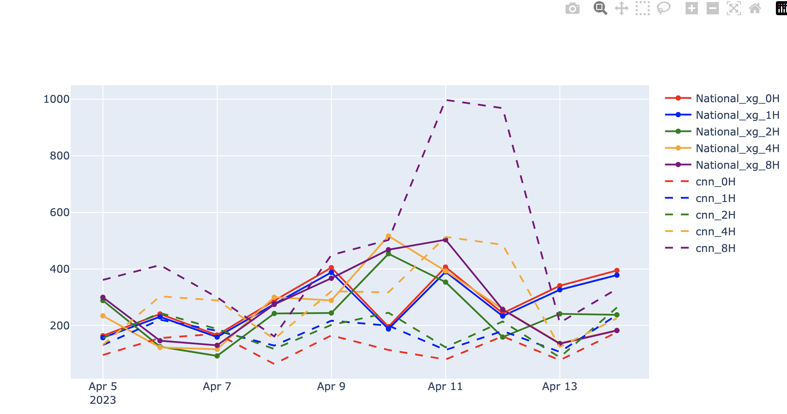

# Compare model

We want to comapre `PVnet` and `National_xg` to see which is better at the moment. 
This with deciding how to blend the models together. We want to look over different forecast horizons. 

We start by looking at dates from `2022-04-05` to `2022-04-14`.

See table results for one day, note these results include the adjuster for PVnet.

| Day        | Horizon [hours] | PVnet | National_xg |
|------------|-----------------|-------|-------------|
| 2022-04-12 | 0               | 161   | 243         |
| 2022-04-12 | 1               | 180   | 233         |
| 2022-04-12 | 2               | 214   | 159         |
| 2022-04-12 | 4               | 485   | 137         |
| 2022-04-12 | 8               | 967   | 256         |

The plot below comapres PVnet (cnn) and National_xg across different forecast horizons. 

We see that
- 0 hour PVnet is better
- 4 hour National_xg and PVnet are about the same
- 8 hour National_xg is better
